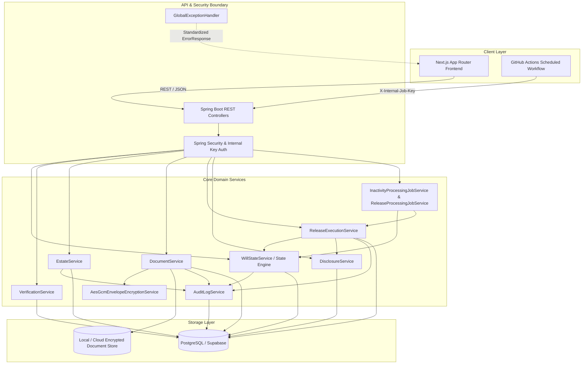

# Digital Will — Phase 2 Architecture Specification

## 1. Overview & Objectives

Phase 2 builds the core security-critical and reliability-critical foundation for the Digital Will platform:
1. **Envelope Encryption & Secure Document Handling:** Zero plain-text document storage; distinct AES-256 Data Encryption Keys (DEKs) wrapped by a Master Key (KEK) using AES-256-GCM.
2. **Tamper-Evident Hash-Chained Audit Logging:** Cryptographic hash chains (SHA-256) per Will with verifiable sequence numbering, detecting any retrospective modification, truncation, or insertion.
3. **Controlled Estate Disclosure & Release Execution:** Strictly partitioned, role-limited disclosures where each beneficiary accesses only their allocated assets and documents.
4. **Idempotent Background Jobs & Concurrency Safety:** Safe scheduled workers triggered via protected internal endpoints, handling worker races, crash recovery, and lease timeouts.
5. **Standardized API Error Contract:** RFC 7807-style error payloads without internal stack traces or sensitive credential leakage.
6. **Frontend State & Error Handling:** Deterministic Next.js 15 App Router interface rendering explicit UI states across all flows.

---

## 2. Component Architecture



---

## 3. Envelope Encryption & Document Vault

### Cryptographic Invariants
- **Cipher:** `AES-256-GCM` (authenticated encryption with 128-bit authentication tag).
- **IV / Nonce:** Unique 96-bit (12 bytes) cryptographically random IV per encryption operation via `SecureRandom`. IV is never reused.
- **Envelope Hierarchy:**
  - **Master Key (KEK):** 256-bit key configured securely via environment variable (`DIGITALWILL_CRYPTO_MASTER_KEY`).
  - **Data Encryption Key (DEK):** Unique 256-bit AES key generated ephemerally for each document.
  - **Wrapped DEK:** DEK is encrypted using KEK via AES-256-GCM with its own unique IV and stored alongside document metadata.
  - **Ciphertext Payload:** The document stream is encrypted using the plaintext DEK, verified via SHA-256 checksum, and written to storage. Plaintext DEK is discarded immediately.
- **Fail-Closed Decryption:** Any tampering, corrupted tag, or mismatch in ciphertext throws `DecryptionFailedException` and prevents data release.

### Schema (`encrypted_documents`)
- `id` (UUID, PK)
- `will_id` (UUID, FK)
- `storage_path` (VARCHAR)
- `original_filename` (VARCHAR)
- `mime_type` (VARCHAR)
- `file_size_bytes` (BIGINT)
- `sha256_checksum` (VARCHAR)
- `encrypted_dek` (VARCHAR, Base64)
- `dek_iv` (VARCHAR, Base64)
- `ciphertext_iv` (VARCHAR, Base64)
- `auth_tag` (VARCHAR, Base64)
- `key_version` (INT)
- `encryption_algorithm` (VARCHAR)
- `uploaded_at` (TIMESTAMP)

---

## 4. Tamper-Evident Hash-Chained Audit Logging

### Tamper-Evident Chaining Invariants
1. **Per-Will Genesis Entry:**
   - The first entry for any will has `sequence_number = 1` and `previous_hash = "0000000000000000000000000000000000000000000000000000000000000000"`.
2. **Deterministic Canonical Hashing:**
   - Hash of entry $N$:
     $$\text{current\_hash}_N = \text{SHA-256}(\text{previous\_hash}_N \,\|\, \text{sequence\_number} \,\|\, \text{will\_id} \,\|\, \text{timestamp} \,\|\, \text{action} \,\|\, \text{status} \,\|\, \text{payload})$$
3. **Sequence Strictness:**
   - Each new entry acquires `sequence_number = last_sequence + 1` with pessimistic locking on the latest entry or will row.
   - Database constraint: `UNIQUE (will_id, sequence_number)`.
4. **Offline & Online Verification:**
   - `AuditLogService.verifyAuditLogIntegrity(willId)` traverses the chain from sequence 1 to $N$, recomputing hashes.
   - Any insertion, deletion, or modification of details breaks the chain and returns `VALID = false` with the exact sequence failure index.

---

## 5. Controlled Estate Disclosure & Release Execution

### Information Partitioning
- **Zero Cross-Exposure:** Beneficiaries do not receive general estate inventories. Beneficiary $B$ can only view records in `disclosed_records` linked to $B$'s UUID.
- **Ephemeral Access Tokens:**
  - Token is a 256-bit high-entropy secret passed in URL parameters (`/disclosure/{token}`).
  - Token is hashed with SHA-256 at rest in `disclosure_tokens`.
  - Token carries `expires_at` (TTL default 7 days) and state tracking (`ACTIVE`, `ACCESSED`, `EXPIRED`, `REVOKED`).
- **Release Execution Items:**
  - Managed via `release_executions` and `release_execution_items`.
  - Each beneficiary release item is individually tracked (`PENDING`, `SUCCESS`, `FAILED`, `RECOVERED`).
  - If a system crash occurs mid-execution, recovery transitions the Will back to `RELEASE_PENDING`, and subsequent attempts skip already `SUCCESS` items via idempotency keys (`UNIQUE (will_id, beneficiary_id)`).

---

## 6. Background Jobs & Concurrency Safety

### Architecture & Endpoints
- Critical succession processing is triggered by scheduled workers via secured REST endpoints:
  - `POST /internal/jobs/process-inactivity`
  - `POST /internal/jobs/process-release`
- Both require the HTTP header `X-Internal-Job-Secret: ${INTERNAL_JOB_SECRET}`.

### Concurrency Guarantees
- **Conditional State Claims:**
  - State transitions use conditional atomic SQL:
    ```sql
    UPDATE wills
    SET state = :newState, executing_at = :now, version = version + 1
    WHERE id = :id AND state = :expectedState AND release_after <= :now AND cancelled_at IS NULL;
    ```
  - If two workers race to process the same will, exactly one updates the row and claims the lease; the other receives 0 affected rows and skips safely.
- **Execution Crash Recovery:**
  - Stalled executions where `executing_at + recovery_timeout < now` are identified by `ReleaseProcessingJobService` and reverted to `RELEASE_PENDING` with items marked for retry.

---

## 7. API Error Contract

All exception handlers produce a consistent RFC 7807-style JSON structure:

```json
{
  "code": "INVALID_STATE_TRANSITION",
  "message": "Cannot transition will from ACTIVE to EXECUTED",
  "status": 409,
  "timestamp": "2026-10-05T20:00:00Z",
  "path": "/api/v1/wills/3fa85f64-5717-4562-b3fc-2c963f66afa6/release",
  "fieldErrors": []
}
```

### HTTP Status Code Mapping
- `400 Bad Request`: `VALIDATION_FAILED`, `TYPE_MISMATCH`, malformed JSON.
- `401 Unauthorized`: `UNAUTHORIZED`, invalid job key, missing credentials.
- `403 Forbidden`: `FORBIDDEN`, unauthorized document or will access.
- `404 Not Found`: `RESOURCE_NOT_FOUND`, `DOCUMENT_NOT_FOUND`, `DISCLOSURE_TOKEN_INVALID`.
- `409 Conflict`: `INVALID_STATE_TRANSITION`, `TRANSITION_GUARD_FAILED`, `DUPLICATE_ENTITY`.
- `410 Gone`: `DISCLOSURE_TOKEN_EXPIRED`, `DISCLOSURE_TOKEN_REVOKED`.
- `500 Internal Server Error`: `INTERNAL_ERROR`, `CRYPTO_ERROR`, `AUDIT_PERSISTENCE_ERROR`.
