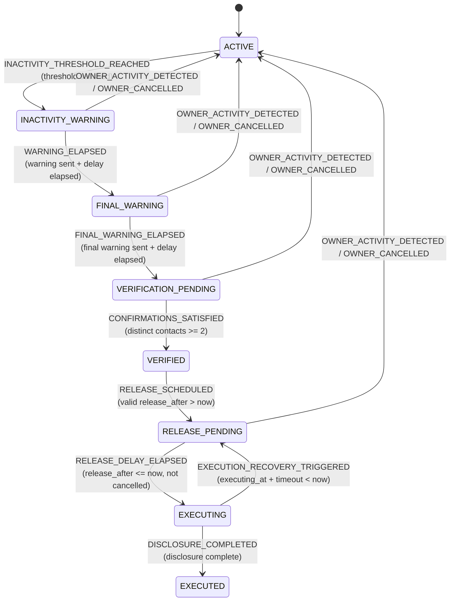

# Digital Will — Authoritative State Machine Specification

## 1. Overview & Core Philosophy

The Digital Will state machine governs the succession lifecycle of a digital estate record.
It is **server-authoritative**, **data-driven**, and enforces strict temporal, authorization, and concurrency invariants at the database layer.

### Key Architectural Invariants
1. **Server-Authoritative State:** The frontend never decides state; state transitions are evaluated and executed exclusively on the backend.
2. **Atomic Guarded Transitions:** Critical state transitions are executed via conditional SQL `UPDATE` statements (e.g., `WHERE id = ? AND state = 'RELEASE_PENDING' AND release_after <= ?`). Exactly 1 affected row indicates success; 0 affected rows indicates that another worker or process already handled the transition.
3. **No Stage-Skipping (Principle 5):** A worker or scheduled job cannot skip intermediate workflow stages (e.g. from `ACTIVE` directly to `VERIFICATION_PENDING` or `EXECUTED`), even if the elapsed time is far beyond the thresholds. Each stage must satisfy explicit notification and timing prerequisites.
4. **Owner Reset Supremacy (Section 17):** Verified owner activity (authenticated login, explicit check-in link) or explicit cancellation in any non-terminal, pre-execution state (`INACTIVITY_WARNING`, `FINAL_WARNING`, `VERIFICATION_PENDING`, `RELEASE_PENDING`) atomically resets the Will back to `ACTIVE`, clearing pending warnings and invalidating verification confirmations.
5. **Terminal Exclusivity:** `EXECUTED` is terminal. Once disclosure and document release operations are complete, no further state transitions are permitted.
6. **Crash Recovery (Section 22):** An `EXECUTING` state that stalls beyond `executionRecoveryTimeout` without completion can be safely recovered back to `RELEASE_PENDING` for idempotent re-execution.
7. **Time Provider Abstraction (Principle 7 & 51):** All business time is evaluated via an injected `TimeProvider` interface, allowing deterministic unit, integration, and accelerated demo testing without changing business logic.

---

## 2. Authoritative State Definitions

| State | Lifecycle Stage | Description | Reset to ACTIVE Permitted? |
| :--- | :--- | :--- | :--- |
| `ACTIVE` | Normal | Normal operational state. The owner has verified activity within threshold. | N/A (Already ACTIVE) |
| `INACTIVITY_WARNING` | Warning | Owner exceeded inactivity threshold; first warning email dispatched. | Yes |
| `FINAL_WARNING` | Warning | Warning delay elapsed with no owner response; final warning dispatched. | Yes |
| `VERIFICATION_PENDING` | Verification | Final warning delay elapsed; trusted contacts must verify unreachable status. | Yes |
| `VERIFIED` | Verification | Required distinct trusted-contact confirmations (2-of-3) received. | Yes (via transition to RELEASE_PENDING) |
| `RELEASE_PENDING` | Safety Window | Safety cancellation window established with future `release_after` timestamp. | Yes |
| `EXECUTING` | Execution | A worker atomically claimed the release operation and is generating disclosures. | No (Recoverable on crash) |
| `EXECUTED` | Terminal | Estate disclosure and document release tokens complete. Terminal state. | **No (Terminal)** |

---

## 3. Transition Table & Guard Invariants



### Detailed Transition Rules

1. **`ACTIVE` &rarr; `INACTIVITY_WARNING`**
   - **Event:** `INACTIVITY_THRESHOLD_REACHED`
   - **Prerequisites / Guards:** `now >= last_verified_activity_at + inactivity_threshold`
   - **Side Effect:** Sets `warning_sent_at = now`, transitions state to `INACTIVITY_WARNING`.

2. **`INACTIVITY_WARNING` &rarr; `FINAL_WARNING`**
   - **Event:** `WARNING_ELAPSED`
   - **Prerequisites / Guards:**
     - First warning notification reached `SENT` (`warning_sent_at IS NOT NULL`).
     - Required warning delay has elapsed (`now >= warning_sent_at + warning_delay`).
     - No verified owner activity occurred after warning (`last_verified_activity_at <= warning_sent_at`).
   - **Side Effect:** Sets `final_warning_sent_at = now`, transitions state to `FINAL_WARNING`.

3. **`FINAL_WARNING` &rarr; `VERIFICATION_PENDING`**
   - **Event:** `FINAL_WARNING_ELAPSED`
   - **Prerequisites / Guards:**
     - Final warning notification reached `SENT` (`final_warning_sent_at IS NOT NULL`).
     - Required final warning delay has elapsed (`now >= final_warning_sent_at + final_warning_delay`).
     - No verified owner activity occurred after final warning (`last_verified_activity_at <= final_warning_sent_at`).
   - **Side Effect:** Sets `verification_started_at = now`, transitions state to `VERIFICATION_PENDING`.

4. **`VERIFICATION_PENDING` &rarr; `VERIFIED`**
   - **Event:** `CONFIRMATIONS_SATISFIED`
   - **Prerequisites / Guards:** Distinct trusted-contact confirmations &ge; required count (MVP standard: 2 of 3 contacts).
   - **Side Effect:** Sets `verified_at = now`, transitions state to `VERIFIED`.

5. **`VERIFIED` &rarr; `RELEASE_PENDING`**
   - **Event:** `RELEASE_SCHEDULED`
   - **Prerequisites / Guards:** Valid `release_after` timestamp strictly in the future relative to `now`.
   - **Side Effect:** Sets `release_after = timestamp`, transitions state to `RELEASE_PENDING`.

6. **`RELEASE_PENDING` &rarr; `EXECUTING`**
   - **Event:** `RELEASE_DELAY_ELAPSED`
   - **Prerequisites / Guards:**
     - Safety delay elapsed (`release_after <= now`).
     - Workflow has not been cancelled (`cancelled_at IS NULL`).
   - **Atomic DB SQL:**
     ```sql
     UPDATE wills
     SET state = 'EXECUTING',
         executing_at = :now,
         updated_at = :now,
         version = version + 1
     WHERE id = :willId
       AND state = 'RELEASE_PENDING'
       AND release_after <= :now
       AND cancelled_at IS NULL;
     ```
   - **Concurrency Guard:** 1 row updated &rarr; claim secured; 0 rows updated &rarr; raced or ineligible.

7. **`EXECUTING` &rarr; `EXECUTED`**
   - **Event:** `DISCLOSURE_COMPLETED`
   - **Prerequisites / Guards:** Estate disclosure generation and document release token generation verified complete.
   - **Side Effect:** Sets `executed_at = now`, state = `EXECUTED`. Terminal state.

8. **Owner Reset (`INACTIVITY_WARNING`, `FINAL_WARNING`, `VERIFICATION_PENDING`, `RELEASE_PENDING` &rarr; `ACTIVE`)**
   - **Event:** `OWNER_ACTIVITY_DETECTED` or `OWNER_CANCELLED`
   - **Prerequisites / Guards:** State &isin; `{INACTIVITY_WARNING, FINAL_WARNING, VERIFICATION_PENDING, RELEASE_PENDING}`.
   - **Side Effects:**
     - Updates `last_verified_activity_at = now`.
     - Clears `warning_sent_at = NULL`, `final_warning_sent_at = NULL`, `verification_started_at = NULL`, `verified_at = NULL`, `release_after = NULL`, `executing_at = NULL`.
     - Records `cancelled_at` if triggered by explicit cancellation.
     - Invalidates pending verification tokens and action links.

9. **Crash Recovery (`EXECUTING` &rarr; `RELEASE_PENDING`)**
   - **Event:** `EXECUTION_RECOVERY_TRIGGERED`
   - **Prerequisites / Guards:** `executing_at + execution_recovery_timeout <= now` and disclosure not completed.
   - **Side Effect:** Reverts state to `RELEASE_PENDING` with `executing_at = NULL` to permit safe retry.

---

## 4. Verification and Concurrency Proofs

The atomicity invariant has been verified via multi-threaded automated test suites (`WillStateConcurrencyTest`):
- **Concurrent Worker Claim Atomicity:** When 10 concurrent threads simultaneously race to claim `EXECUTING` on an eligible `RELEASE_PENDING` Will, exactly 1 worker claims the transition (1 row updated) and 9 workers fail (0 rows updated).
- **Claim vs. Owner Reset Race:** When a worker attempts to claim execution concurrently with an owner logging in / resetting to `ACTIVE`, the database guarantees mutual exclusion: exactly one operation succeeds, preventing partial disclosure or corrupted states.
